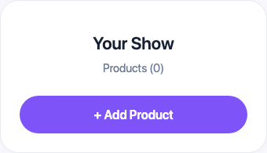
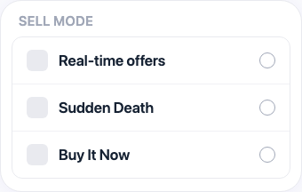
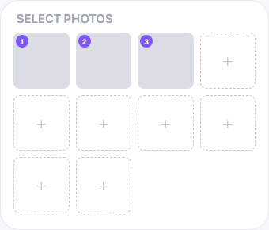
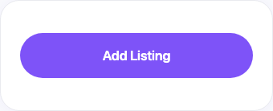

# New Seller Guide to Listing Products

## What you'll learn

This guide walks you through how to create product listings on Jamble. You'll learn what information is needed for each product, how to choose the right sell mode, and tips to make your products stand out to buyers.

## Before you start

You need:
- An approved seller account on Jamble
- Products you want to sell (with photos ready)
- A show created or scheduled (products are listed within shows)

## How listing works on Jamble

You list products by adding them to a show you're preparing. When you open a show to add products, you'll use a fast listing form designed to get your products ready quickly before going live.

Some fields are **required** (title, sell mode, shipping profile, price) and some are **optional but recommended** (photos, category, brand, color, condition). The more detail you add, the better your products will look to buyers.

## Step by step

### Step 1: Open your show and add a product

Go to the show you've created, then tap the option to add a product.

### Step 2: Add a title

Enter a clear, specific title for your product. You have **60 characters** maximum.

**Good examples:**
- "Nike Air Max 90 - Size 42 - White/Black"
- "Camiseta Vintage Band - M - Preta"

**Bad examples:**
- "Sneakers" (too vague)
- "Beautiful amazing shoes great deal!!!" (not descriptive)

### Step 3: Choose a sell mode

Select how you want to sell this item during your show:

- **Real-time offers** — buyers compete by placing offers. The highest offer wins when the timer ends
- **Sudden Death** — similar to Real-time offers, but no extra time is added when someone places an offer. The timer counts down without extensions
- **Buy It Now** — fixed price. Buyers purchase instantly at the price you set. You can also enable a Flash Sale with a percentage discount and a timer

### Step 4: Set your price

Enter the price in R$. The minimum price is **R$ 5.00** and the maximum is **R$ 5,000.00**.

- For **Real-time offers** and **Sudden Death**, this is the **starting price**. Buyers will place offers above this amount during your show
- For **Buy It Now**, this is the **fixed price** the buyer pays

You can also add a **retail price** (optional) — this shows buyers the original price so they can see the value of your offer.

### Step 5: Choose a shipping profile

Select the shipping profile that matches the size and weight of your packaged item.

- **Card** — Trading cards, single flat items
- **Booster** — Card packs, multiple cards
- **Light Accessories** — Jewelry, scarves, small items
- **Light Apparel** — T-shirts, tank tops, blouses
- **Standard Apparel** — Shirts, dresses, sweaters
- **Heavier Apparel** — Jeans, thick dresses, trousers
- **Bulkier Items** — Jackets, winter coats
- **Small Bundles** — Small groups of items
- **Medium Bundles** — Medium groups of items
- **Large Bundles** — Large groups of items
- **Extra-Large Bundles** — Very large orders
**Choose accurately** — the shipping profile determines the shipping cost the buyer pays. If the profile is too small, you may have trouble shipping. If it's too big, the buyer pays more than necessary.

### Step 6: Add photos (optional but recommended)

Add up to **10 photos** of your product. Photos are optional when listing for a show, but they make a big difference — buyers are much more likely to place offers on items they can see clearly.

**Tips for great photos:**
- Use good lighting (natural light works best)
- Show the item from multiple angles
- Include close-ups of details, tags, and any flaws
- Place the item on a clean, simple background

### Step 7: Add more details (optional but recommended)

You can also fill in these fields to make your listing more complete:

- **Description** — a short description (120 characters max) with condition details, material, or anything the photos don't show
- **Category** — organized in three levels: Gender (Men/Women) → Category (Clothes, Shoes, Bags, Accessories, Beauty) → Subcategory (e.g., Sneakers, T-Shirts/Tops). Once you select all three, a **Size** field appears with size options specific to your selection
- **Brand** — type or search for the brand name
- **Color** — choose from 28 color options (Black, White, Grey, Blue, Red, etc.)
- **Condition** — how worn the item is:

- **New with Tags** — Brand new, never worn, original tags still attached
- **New without Tags** — Brand new, never worn, but tags removed
- **Very Good** — Like new, barely used, excellent condition
- **Good** — Gently used, some signs of wear
- **Satisfactory** — Well-used, visible wear, may need repair
**Be honest about condition.** Buyers trust sellers who accurately describe their items. Over-rating the condition leads to returns and bad reviews.

**For collectibles:** Jamble also supports categories like Trading Card Games (Pokémon, Magic, Yu-Gi-Oh!, One Piece), Diecast Cars (Hot Wheels, Matchbox), and more.

### Step 8: Save your listing

When all required fields are filled, the **Add Listing** button becomes active. Tap it to save your listing.

Your product is now added to your show and ready to be sold during your live.

## Pre-offer option

For Real-time offers and Sudden Death items, you can enable **pre-offers**. This lets buyers place offers on your product before the show starts. Pre-offers are only available when the product quantity is 1.

## Important tips

- **Use clear, specific titles.** "Nike Dunk Low Panda 42" will always perform better than "Cool sneakers for sale"
- **Photos sell the item.** Even though photos are optional, take the time to photograph your products well. Good photos are the biggest factor in getting buyers interested
- **Be honest about condition.** It builds trust and prevents returns. If there's a flaw, mention it and show it in a photo
- **The app remembers your last listing.** When you create a new product, Jamble auto-fills some fields (category, brand, shipping profile) based on your previous listing. This saves time when listing similar items
- **You can edit or clone listings.** After creating a listing, you can edit it at any time. You can also clone (duplicate) a listing to quickly create similar products

## Common questions

**What's the minimum price I can set?**
R$ 5.00 for all sell modes.

**How many photos can I add?**
Up to 10 photos per listing. Photos are optional but strongly recommended.

**Can I edit a listing after creating it?**
Yes. You can update the title, price, photos, category, and any other field at any time. Tap the listing and select **Save Changes** when done.

**What's the difference between Real-time offers and Buy It Now?**
With Real-time offers, buyers compete by placing offers during your show. The highest offer wins. With Buy It Now, buyers purchase at the fixed price you set — no competition, instant purchase.

**Can I list the same product in multiple quantities?**
Yes. When creating a listing, set the quantity to the number of identical items you have. You can set up to 1,000 units.

**What is Pack Opening?**
Pack Opening is a special mode for collectible items (like trading card booster packs) where you open the pack live during your show.

**What happens if I pick the wrong shipping profile?**
You can change the shipping profile on any listing before it sells. If you realize after a sale, contact support for help.

## Need help?

Contact us through the app chat or email support@jambleapp.com.
