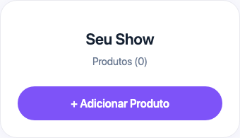
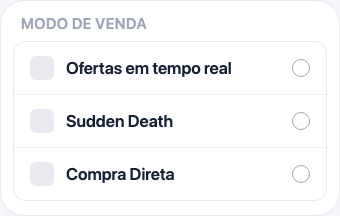
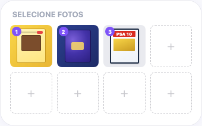
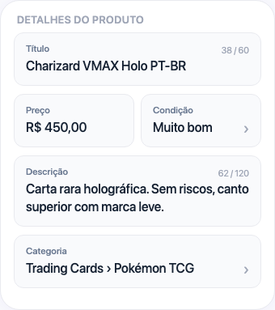
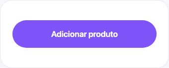

# Guia do Novo Vendedor para Listar Produtos

## O que você vai aprender

Este guia te acompanha na criação de listagens de produtos na Jamble. Você vai aprender quais informações são necessárias para cada produto, como escolher o modo de venda certo e dicas para fazer seus produtos se destacarem para os compradores.

## Antes de começar

Você precisa de:
- Uma conta de vendedor aprovada na Jamble
- Produtos que você quer vender (com fotos prontas)
- Um show criado ou agendado (produtos são listados dentro de shows)

## Como funciona a listagem na Jamble

Você lista produtos adicionando-os a um show que está preparando. Quando você abre um show para adicionar produtos, vai usar um formulário rápido de listagem feito para deixar seus produtos prontos antes de ir ao vivo.

Alguns campos são **obrigatórios** (título, modo de venda, perfil de envio, preço) e outros são **opcionais mas recomendados** (fotos, categoria, marca, cor, condição). Quanto mais detalhes você adicionar, melhor seus produtos vão parecer para os compradores.

## Passo a passo

### Passo 1: Abra seu show e adicione um produto

Vá ao show que você criou, depois toque na opção de adicionar um produto.

### Passo 2: Adicione um título

Digite um título claro e específico para seu produto. Você tem no máximo **60 caracteres**.

**Bons exemplos:**
- "Charizard VMAX Holo Swsh Promo PSA 10"
- "Hot Wheels Super Treasure Hunt 2019 Datsun"
- "Booster Pokémon TCG Escarlate e Violeta Lacrado"

**Exemplos ruins:**
- "Carta" (muito vago)
- "Carta linda rara promoção imperdível!!!" (não é descritivo)

### Passo 3: Escolha um modo de venda

Selecione como você quer vender este item durante seu show:

- **Ofertas em tempo real**: os compradores competem fazendo ofertas. A oferta mais alta ganha quando o tempo acaba
- **Sudden Death**: similar às ofertas em tempo real, mas tempo extra não é adicionado quando alguém faz uma oferta. O cronômetro conta sem extensões
- **Compra Direta**: preço fixo. Os compradores compram instantaneamente pelo preço que você definiu. Você também pode ativar uma Venda Relâmpago com um desconto percentual e um cronômetro

### Passo 4: Defina seu preço

Digite o preço em R$. O preço mínimo é **R$ 5,00** e o máximo é **R$ 5.000,00**.

- Para **Ofertas em tempo real** e **Sudden Death**, este é o **preço inicial**. Os compradores vão fazer ofertas acima deste valor durante seu show
- Para **Compra Direta**, este é o **preço fixo** que o comprador paga

Você também pode adicionar um **preço de varejo** (opcional): isso mostra aos compradores o preço original para que eles vejam o valor da sua oferta.

### Passo 5: Escolha um perfil de envio

Selecione o perfil de envio que corresponde ao tamanho e peso do seu item embalado. Para colecionáveis, os perfis mais usados no Brasil são:

- **Carta**: cartas avulsas (Pokémon TCG, Magic, Yu-Gi-Oh!, One Piece), itens planos
- **Booster**: pacotes de cartas, múltiplas cartas juntas
- **Acessórios leves**: pinos, chaveiros, itens pequenos
- **Pacotes pequenos**: grupos pequenos de cartas ou miniaturas (Hot Wheels, Matchbox)
- **Pacotes médios**: caixas de boosters, lotes médios
- **Pacotes grandes**: displays, coleções
- **Itens volumosos**: figuras grandes, caixas colecionáveis
- **Pacotes extra-grandes**: pedidos muito grandes

**Escolha com cuidado.** O perfil de envio determina o custo de frete que o comprador paga. Se o perfil for pequeno demais, você pode ter problemas para enviar. Se for grande demais, o comprador paga mais do que o necessário.

### Passo 6: Adicione fotos (opcional mas recomendado)

Adicione até **10 fotos** do seu produto. As fotos são opcionais ao listar para um show, mas fazem uma grande diferença: os compradores têm muito mais chance de fazer ofertas em itens que conseguem ver claramente.

**Dicas para ótimas fotos:**
- Use boa iluminação (luz natural perto de uma janela funciona melhor)
- Mostre o item de vários ângulos (frente, verso, e cantos para cartas)
- Inclua close-ups de detalhes, assinaturas, grading (PSA, CGC) e defeitos
- Coloque o item em um fundo limpo e simples (papel branco ou tecido neutro)
- Para Hot Wheels e Diecast: fotografe a embalagem fechada e as marcações da base

### Passo 7: Preencha os detalhes da listagem

Confirme ou ajuste os campos principais da sua listagem: título, preço, condição, descrição e categoria.

Você também pode preencher estes campos para deixar sua listagem mais completa:

- **Descrição**: uma descrição curta (máximo 120 caracteres) com detalhes sobre condição, edição, grading ou qualquer coisa que as fotos não mostram
- **Categoria**: escolha a categoria certa. Para colecionáveis Brasil: **Trading Card Games** (Pokémon, Magic, Yu-Gi-Oh!, One Piece), **Diecast** (Hot Wheels, Matchbox), e outras categorias de colecionáveis
- **Marca**: digite ou busque o nome da marca (ex: Pokémon, Hot Wheels, Mattel)
- **Cor**: escolha entre 28 opções de cores quando relevante
- **Condição**: o nível de conservação do item:

- **Novo com etiquetas**: lacrado, nunca aberto, etiquetas originais presentes
- **Novo sem etiquetas**: nunca usado, em perfeito estado, sem embalagem original
- **Muito bom**: quase perfeito, sinais mínimos de manuseio
- **Bom**: usado com cuidado, alguns sinais de uso ou armazenamento
- **Satisfatório**: sinais visíveis de uso, pode ter defeitos leves

**Seja honesto sobre a condição.** Os compradores confiam em vendedores que descrevem seus itens com precisão. Exagerar na condição leva a devoluções e avaliações ruins.

### Passo 8: Salve sua listagem

Quando todos os campos obrigatórios estiverem preenchidos, o botão **Adicionar produto** fica ativo. Toque nele para salvar sua listagem.

Seu produto agora está adicionado ao seu show e pronto para ser vendido durante sua live.

## Opção de pré-oferta

Para itens de **Ofertas em tempo real** e **Sudden Death**, você pode ativar **pré-ofertas**. Isso permite que os compradores façam ofertas no seu produto antes do show começar. Pré-ofertas só estão disponíveis quando a quantidade do produto é 1.

## Dicas importantes

- **Use títulos claros e específicos.** "Charizard VMAX Holo PSA 10" sempre vai performar melhor do que "carta rara à venda"
- **Fotos vendem o item.** Mesmo que as fotos sejam opcionais, dedique um tempo para fotografar bem seus produtos. Boas fotos são o maior fator para atrair compradores
- **Mostre o grading quando tiver.** Cartas graduadas (PSA, CGC, BGS) devem aparecer com a etiqueta visível na primeira foto
- **Seja honesto sobre a condição.** Isso gera confiança e previne devoluções. Se tem um defeito, mencione e mostre na foto
- **O app lembra da sua última listagem.** Quando você cria um novo produto, a Jamble preenche automaticamente alguns campos (categoria, marca, perfil de envio) com base na sua listagem anterior. Isso economiza tempo ao listar itens similares
- **Você pode editar ou clonar listagens.** Depois de criar uma listagem, você pode editá-la a qualquer momento. Você também pode clonar (duplicar) uma listagem para criar rapidamente produtos similares

## Perguntas frequentes

**Qual é o preço mínimo que posso definir?**
R$ 5,00 para todos os modos de venda.

**Quantas fotos posso adicionar?**
Até 10 fotos por listagem. As fotos são opcionais mas fortemente recomendadas.

**Posso editar uma listagem depois de criá-la?**
Sim. Você pode atualizar o título, preço, fotos, categoria e qualquer outro campo a qualquer momento. Toque na listagem e selecione **Salvar alterações** quando terminar.

**Qual a diferença entre Ofertas em tempo real e Compra Direta?**
Com Ofertas em tempo real, os compradores competem fazendo ofertas durante seu show e a oferta mais alta ganha. Com Compra Direta, os compradores compram pelo preço fixo que você definiu, sem competição, compra instantânea.

**Posso listar o mesmo produto em múltiplas quantidades?**
Sim. Ao criar uma listagem, defina a quantidade para o número de itens idênticos que você tem. Você pode definir até 1.000 unidades.

**O que é Pack Opening?**
Pack Opening é um modo especial para boosters e packs de trading cards, onde você abre o pacote ao vivo durante seu show.

**E se eu escolher o perfil de envio errado?**
Você pode mudar o perfil de envio de qualquer listagem antes que ela seja vendida. Se perceber depois de uma venda, entre em contato com o suporte para ajuda.

## Precisa de ajuda?

Entre em contato pelo chat do app ou envie um email para support@jambleapp.com.
