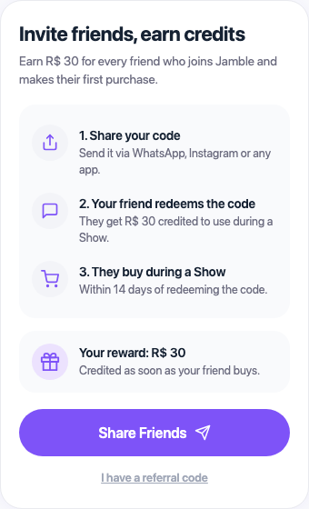
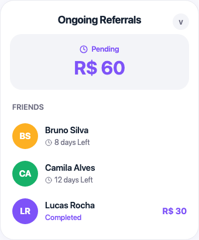

# Referral Program

## What you'll learn

This guide explains how Jamble's Referral Program works. You'll learn how to invite friends to Jamble, how you both earn R$ 30, and how to track your referrals in the app.

## Before you start

You need:

- An active Jamble account
- The Jamble app installed on your phone

## How the program works

Invite a friend, they get R$ 30 for their first purchase and you get R$ 30 when they buy. The program is simple and works for any new account.

- **You earn R$ 30** when your friend makes their first purchase at a Show
- **Your friend earns R$ 30** as soon as they redeem your invite code
- **Rewards are credits** applied automatically at checkout

## Step by step

### Step 1: Open the Invite Friends screen

Go to your profile in the app and tap **Invite Friends**. You'll see the program steps, your R$ 30 reward, and the **Share Friends** button.

### Step 2: Share your link

Tap **Share Friends** to open your phone's sharing menu. You can send the link via WhatsApp, Instagram, SMS, or any other app.

The link already contains your code, so your friend doesn't need to type anything. They just need to tap the link and download the app.

**Tip**: WhatsApp is the most effective channel in Brazil. Your friend taps the link and enters Jamble in seconds.

### Step 3: Your friend redeems and purchases

When your friend opens the app for the first time with your link:

1. **They redeem the code** and R$ 30 appears in their account right away
2. **They have 14 days to buy 1 item at a Show** using the credit
3. **You receive R$ 30** as soon as their purchase is confirmed

Both your friend's credit and your reward expire 14 days after they're credited. Use before time runs out.

## How to track your referrals

On the referral screen you can open **Ongoing Referrals** (friends who redeemed the code but haven't purchased yet) or **Past Referrals** (completed referrals).

Each friend on the list shows their name and status:

- **days Left** for friends still within the 14-day window
- **Completed** when the referral worked out and you already received the R$ 30
- **Deadline Missed** if your friend didn't purchase within 14 days

## How credits work

All referral rewards are **credits** in your Jamble account. They're applied automatically at your next checkout to cover part (or all) of your purchase.

**Credits expire in 14 days**, so use them fast. This applies to both your credit and your friend's credit.

## Important tips

- **Share via WhatsApp** so your friend enters Jamble in just a few taps
- **Your code is unique and permanent**, based on your username. You don't need to generate a new one for each invite
- **The referral only works for new accounts**. Anyone who already has Jamble can't redeem a code
- **Your friend needs to purchase at a Show**, not anywhere else in the app
- **Remind your friend** to use their credit before 14 days, or they'll lose it

## Frequently asked questions

**Where do I find my referral code?**
Go to your profile and tap **Invite Friends**. Your code appears there. You can also share directly with the **Share Friends** button, so your friend receives the link with the code already included.

**My friend signed up but I didn't receive my reward. Why?**
The reward is only credited after your friend purchases 1 item at a Show. If they redeemed the code but haven't purchased yet, the referral stays in **Ongoing Referrals**.

**How much time does my friend have to complete the referral?**
They have 14 days after redeeming the code to make their first purchase at a Show. After that deadline, the referral expires and neither you nor they receive anything.

**Do credits work on any purchase?**
Credits are applied automatically at checkout for purchases made at Shows. They cover part or all of the amount, depending on the item price.

**Can I refer someone who already has a Jamble account?**
No. Codes only work for brand new accounts. If the person already has Jamble, the code won't be accepted.

**Is there a limit on how many friends I can refer?**
No limit. You can invite as many friends as you want and earn R$ 30 for each one who makes their first purchase.

## Need help?

Contact us via the in-app chat or email support@jambleapp.com.
