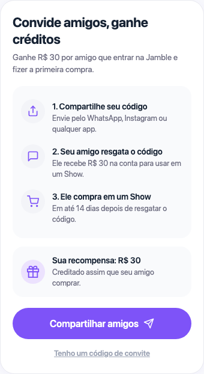
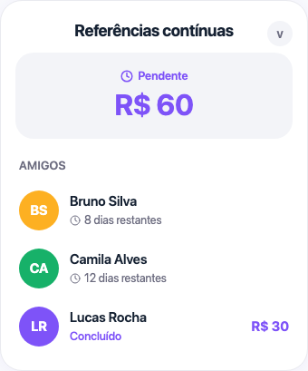

# Programa de Indicação

## O que você vai aprender

Este guia explica como o Programa de Indicação da Jamble funciona. Você vai aprender como convidar amigos para a Jamble, como vocês dois ganham R$ 30, e como acompanhar suas indicações no app.

## Antes de começar

Você precisa de:

- Uma conta ativa na Jamble
- O app da Jamble instalado no seu celular

## Como funciona o programa

Convide um amigo, ele ganha R$ 30 para a primeira compra e você ganha R$ 30 quando ele comprar. O programa é simples e vale para qualquer conta nova.

- **Você ganha R$ 30** quando seu amigo faz a primeira compra em um Show
- **Seu amigo ganha R$ 30** assim que resgata o seu código de convite
- **As recompensas são créditos** aplicados automaticamente no checkout

## Passo a passo

### Passo 1: Abra a tela Convidar amigos

Vá ao seu perfil no app e toque em **Convidar amigos**. Você vai ver os passos do programa, sua recompensa de R$ 30 e o botão **Compartilhar amigos**.

### Passo 2: Compartilhe seu link

Toque em **Compartilhar amigos** para abrir o menu de compartilhamento do seu celular. Você pode enviar o link pelo WhatsApp, Instagram, SMS ou qualquer outro app.

O link já contém seu código, então seu amigo não precisa digitar nada. Ele só precisa tocar no link e baixar o app.

**Dica**: o WhatsApp é o canal mais eficaz no Brasil. Seu amigo toca no link e já entra na Jamble em segundos.

### Passo 3: Seu amigo resgata e compra

Quando seu amigo abre o app pela primeira vez com o seu link:

1. **Ele resgata o código** e R$ 30 aparecem na conta dele na hora
2. **Ele tem 14 dias para comprar 1 item em um Show** usando o crédito
3. **Você recebe R$ 30** assim que a compra dele é confirmada

Tanto o crédito do seu amigo quanto a sua recompensa expiram 14 dias depois de serem creditados. Use antes que o tempo acabe.

## Como acompanhar suas indicações

Na tela de indicação você pode abrir **Referências contínuas** (amigos que resgataram o código mas ainda não compraram) ou **Referências anteriores** (indicações já concluídas).

Cada amigo na lista mostra o nome dele e o status:

- **Dias restantes** para os amigos que ainda estão dentro dos 14 dias
- **Concluído** quando a indicação deu certo e você já recebeu os R$ 30
- **Prazo perdido** se seu amigo não comprou dentro dos 14 dias

## Como os créditos funcionam

Todas as recompensas de indicação são **créditos** na sua conta Jamble. Eles são usados automaticamente no seu próximo checkout para cobrir parte (ou todo) o valor da compra.

**Os créditos expiram em 14 dias**, então use rápido. Vale tanto para o seu crédito quanto para o do seu amigo.

## Dicas importantes

- **Compartilhe pelo WhatsApp** para o amigo entrar na Jamble em poucos toques
- **Seu código é único e permanente**, baseado no seu nome de usuário. Você não precisa gerar um novo a cada convite
- **A indicação só vale para contas novas**. Quem já tem Jamble não pode resgatar um código
- **Seu amigo precisa comprar em um Show**, não em qualquer lugar do app
- **Lembre seu amigo** de usar o crédito dele antes dos 14 dias, senão ele perde

## Perguntas frequentes

**Onde encontro meu código de indicação?**
Vá ao seu perfil e toque em **Convidar amigos**. Seu código aparece lá. Você também pode compartilhar direto pelo botão **Compartilhar amigos**, assim seu amigo recebe o link com o código já incluído.

**Meu amigo se cadastrou mas eu não recebi minha recompensa. Por quê?**
A recompensa só é creditada depois que seu amigo comprar 1 item em um Show. Se ele resgatou o código mas ainda não comprou, a indicação fica em **Referências contínuas**.

**Quanto tempo meu amigo tem para completar a indicação?**
Ele tem 14 dias depois de resgatar o código para fazer a primeira compra em um Show. Depois desse prazo, a indicação expira e nem ele nem você recebem nada.

**Os créditos funcionam em qualquer compra?**
Os créditos são aplicados automaticamente no checkout de compras feitas em Shows. Eles cobrem parte ou todo o valor, dependendo do preço do item.

**Posso indicar alguém que já tem uma conta Jamble?**
Não. Os códigos só funcionam para contas totalmente novas. Se a pessoa já tem Jamble, o código não é aceito.

**Existe um limite de quantos amigos posso indicar?**
Não há limite. Você pode convidar quantos amigos quiser e ganhar R$ 30 por cada um que fizer a primeira compra.

## Precisa de ajuda?

Entre em contato pelo chat do app ou envie um email para support@jambleapp.com.
