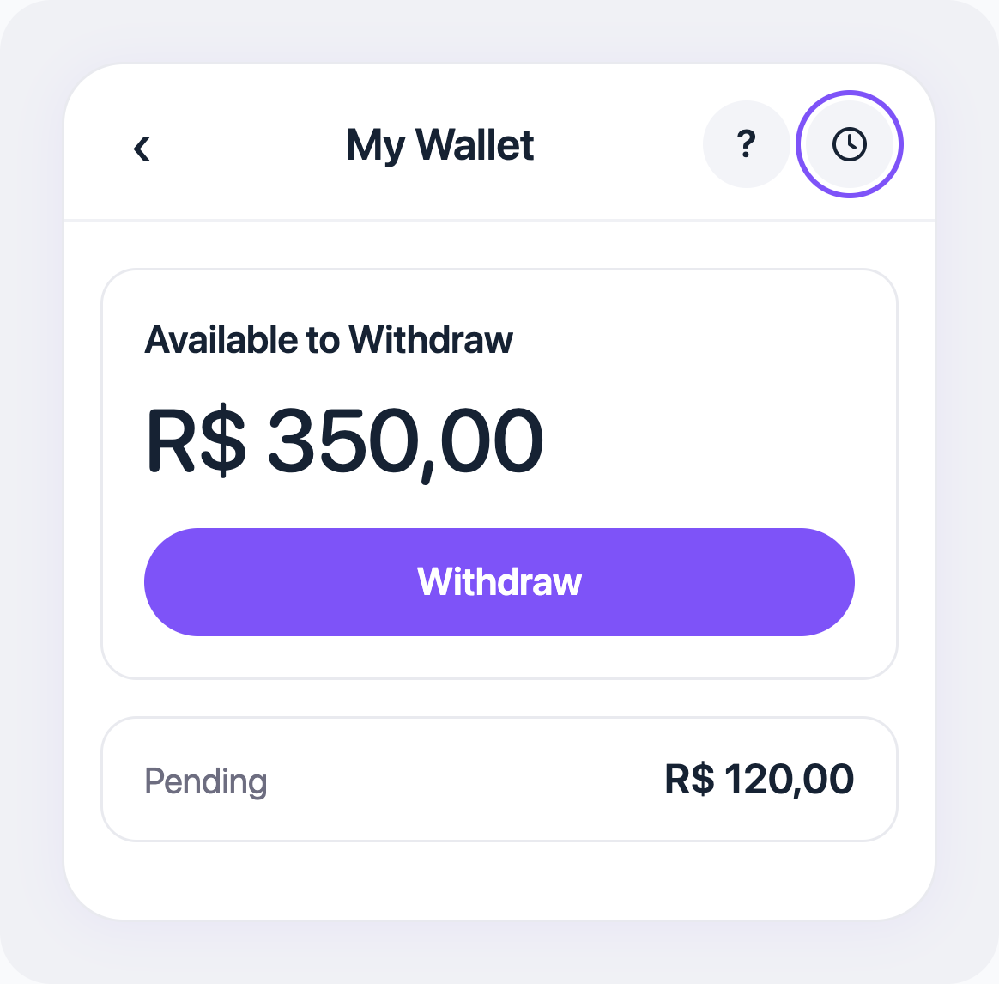
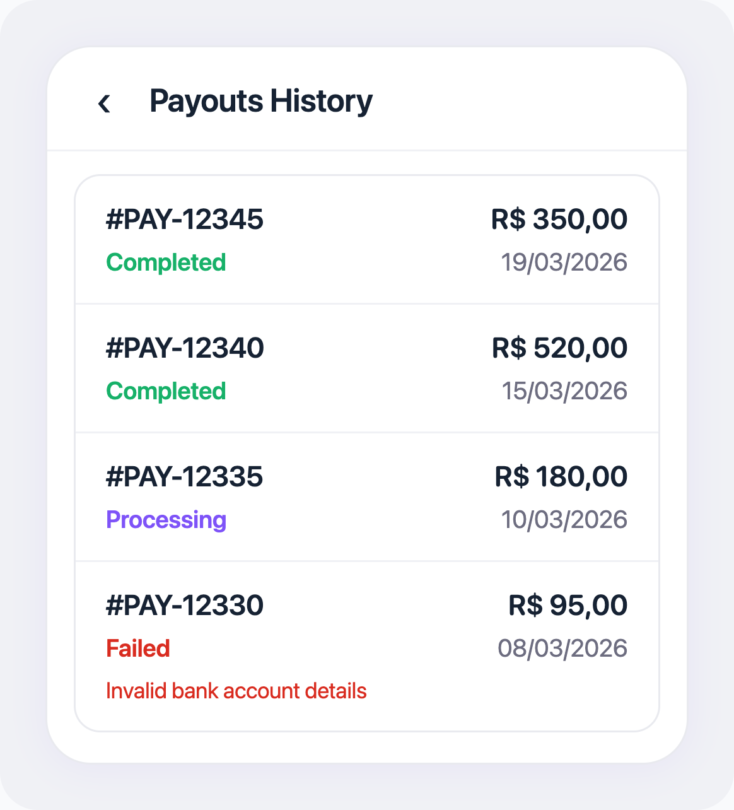
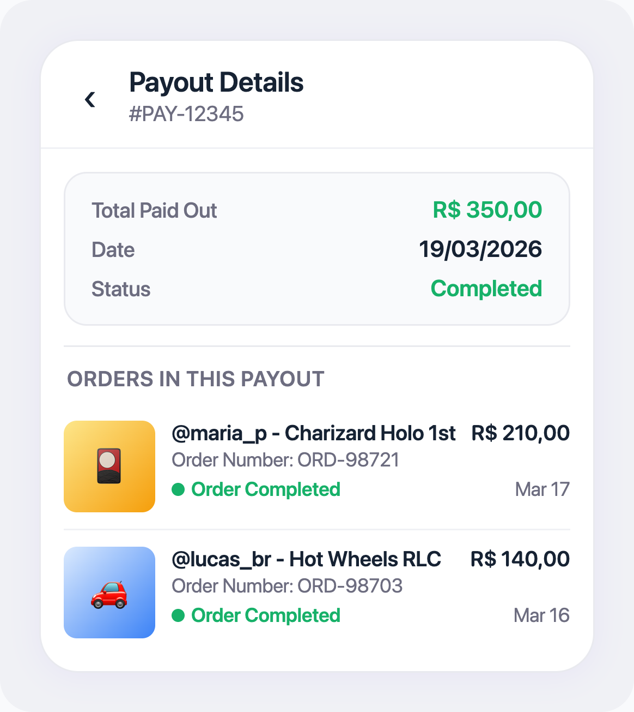

# Extratos do Seller - Veja Seu Histórico de Saques

## O que você vai aprender

Este guia explica como acessar e entender seu histórico financeiro na Jamble. Você vai aprender a abrir a tela Payouts History, ler cada entrada de saque e abrir um saque específico para ver os pedidos incluídos nele.

## Antes de começar

Você precisa de:
- Uma conta de vendedor aprovada na Jamble
- Pelo menos um saque concluído (para ter histórico a visualizar)

## Passo a passo

### Passo 1: Abra sua carteira

Vá ao seu perfil, depois toque em **Settings** e depois em **My Wallet**.

### Passo 2: Abra o Payouts History

No canto superior direito da tela da carteira, toque no **ícone de relógio** (ao lado do botão de ajuda). Isso abre a tela **Payouts History**.

### Passo 3: Revise seus saques

A tela Payouts History mostra todos os seus registros de saques, com os mais recentes no topo.

Cada entrada de saque mostra quatro informações:

- **ID do saque**: um número de referência único para este saque
- **Valor**: o valor em R$ que foi (ou tentou ser) transferido
- **Status**: o estado atual (Created, Processing, Pending, Completed, Failed, Canceled)
- **Data**: quando você solicitou o saque

### Passo 4: Toque em um saque para ver os detalhes

Toque em qualquer entrada da lista para abrir a tela **Payout Details**. Ela mostra o ID do saque no topo e a lista de pedidos que compõem aquele pagamento, com comprador, produto, número do pedido e valor.

### Passo 5: Role para ver registros antigos

Role para baixo na lista de saques para carregar mais entradas. Você também pode **puxar para baixo para atualizar** a tela e ver as últimas atualizações.

## Entendendo seus extratos

### Cores dos status

- **Roxo** (Created, Processing, Pending): seu saque está em andamento
- **Verde** (Completed): o dinheiro foi depositado no seu banco
- **Vermelho** (Failed, Canceled): algo deu errado ou o saque foi interrompido

### Lendo seu histórico

Seu Payouts History é o registro de cada saque que você fez. Use-o para:
- **Verificar depósitos**: confira saques Completed com seus extratos bancários
- **Acompanhar saques pendentes**: veja se um saque recente ainda está sendo processado
- **Identificar problemas**: detecte saques Failed que precisam de atenção
- **Manter registros**: mantenha um histórico dos seus ganhos na Jamble

## Dicas importantes

- **Verifique o Payouts History após cada saque.** Crie o hábito de conferir se seus saques atingem o status Completed
- **Guarde seus IDs de saque.** Se precisar contatar o suporte sobre um saque específico, ter o ID torna a resolução muito mais rápida
- **Saques falhados precisam de ação.** Se vir um status Failed, volte à sua carteira, verifique seus dados bancários e solicite um novo saque
- **Seu saldo na carteira é separado do histórico de saques.** A carteira mostra seu saldo disponível atual. O Payouts History mostra o registro de todos os saques passados

## Perguntas frequentes

**Posso exportar meu histórico de saques?**
No momento, o histórico de saques só pode ser visualizado no app. Para fins fiscais ou contábeis, você pode tirar screenshots ou anotar os detalhes manualmente.

**Até onde vai o histórico?**
Todo o seu histórico de saques desde que você começou a vender na Jamble está disponível. Role para baixo para carregar registros mais antigos.

**Posso ver quais pedidos compõem um saque?**
Sim. Toque em qualquer saque na lista para abrir Payout Details, que mostra cada pedido incluído naquele pagamento (comprador, produto, número do pedido e valor).

**Por que vejo um saque Failed?**
Um saque falha quando a transferência PIX para seu banco não pôde ser concluída, geralmente por dados bancários incorretos. Verifique e atualize suas informações bancárias, depois solicite um novo saque.

**O valor não corresponde ao que eu esperava. Por quê?**
Saques transferem todo o seu saldo disponível na carteira no momento da solicitação. Se alguns pedidos ainda estavam pendentes quando você sacou, esses ganhos não foram incluídos. Eles estarão disponíveis no seu próximo saque depois que os pedidos forem concluídos.

## Precisa de ajuda?

Entre em contato pelo chat do app ou envie um email para support@jambleapp.com.
